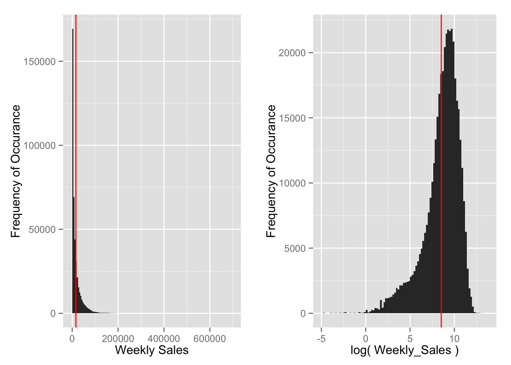
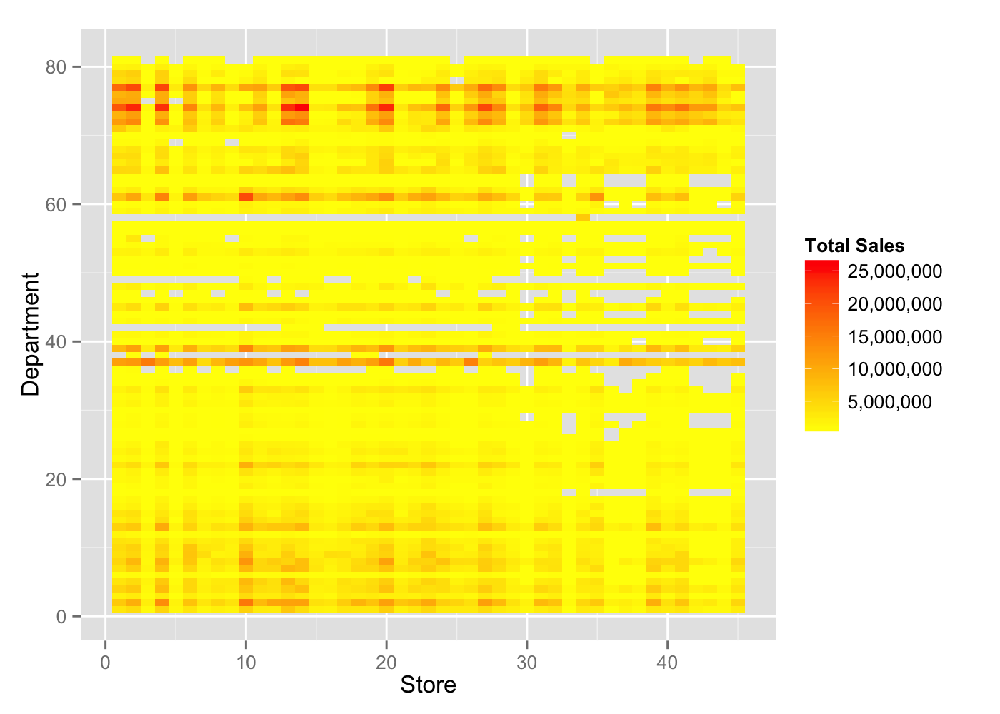
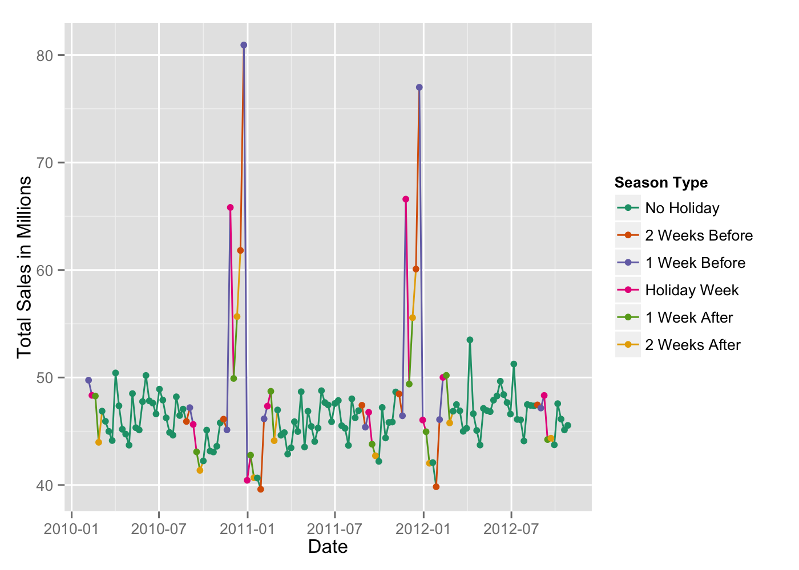
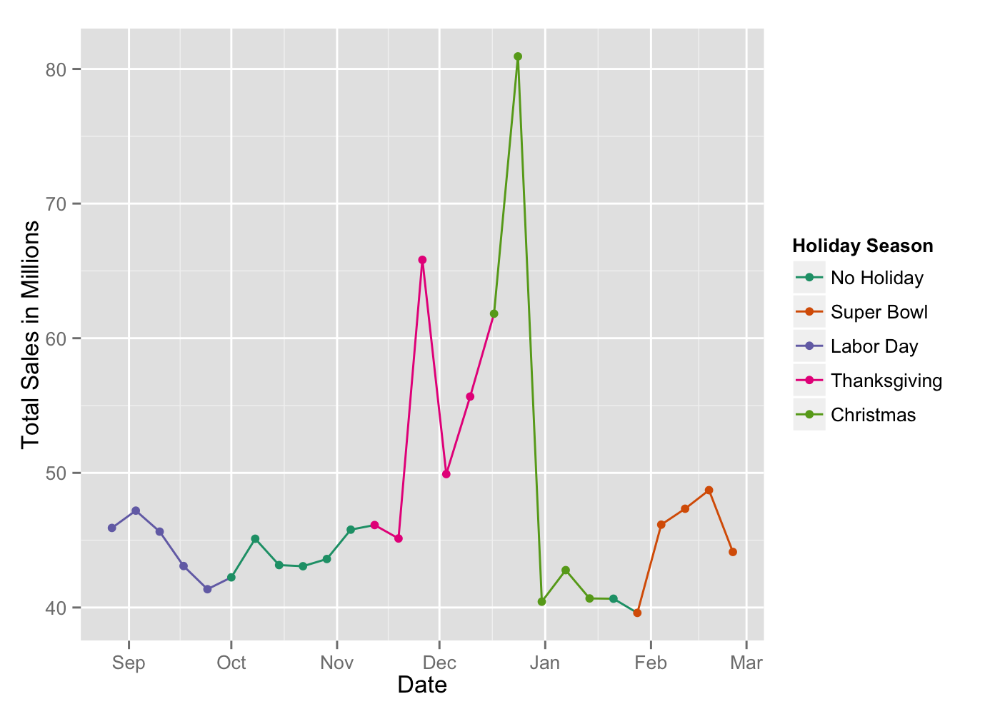

# Predicting Weekly Sales at Walmart Stores
  
August 31, 2015  


<BR>

# 1. Executive Summary
Retail stores need to be able to predict sales forecasts for the future and study the effect how strategic offers affect sales, especially during holiday season. Since the number of days in holidays are limited, it becomes more challenging to be able to accurately predict how different aspects affect sales.

This report will focus on a Walmart Data set that has Department-wise Weekly Sales of 45 Walmart stores. It will attempt to create a predictive model and also discuss the extent to which different factors affect the sales.


# 2. Introduction


## 2.1 About the Solution Environment
The authors implemented this solution in R. We have used R Markdown Report to create this document. First we explore and prepare the data set before carrying out formal statistical inferences on the data set. We wrap the report by building a model to predict Weekly sales of the departments belonging to the 45 stores in this data set.


## 2.2 About the Data
The data set under consideration is taken from a recruitment competition Walmart ran on Kaggle between February-May 2014. Each store has multiple departments and the end requirement is to be able to predict the sales for individual departments of each store.

The training data set has more than 400K records. The testing data set has over 100K records.


### 2.2.1 The Challenge
The challenge is to be able to predict how different holiday price markdowns affect the various departments in the store, to model extent of impact of these markdowns.

<IMAGE src="Images/markdowns.png" />


## 2.3 Getting the Data
The data was download from Kaggle.

URL to the Kaggle Competition Site: https://www.kaggle.com/c/walmart-recruiting-store-sales-forecasting

The files available are the following:<BR>
<IMAGE src="Images/DataFilesImage.png" />

### 2.3.1 The Data Files
Here we discuss the various CSV Files that are given by Walmart.

#### 2.3.1.1 stores.csv
Contains size and type of 45 stores (45 records).

#### 2.3.1.2 train.csv
Weekly sales data set from February 05, 2010 to November 11, 2012. It contains the following fields:

* Store: store number
* Dept: the department number
* Date: week date
* Weekly_Sales: sales for the given department in the given store
* IsHoliday: whether the week is a special holiday week

#### 2.3.1.3 test.csv
The data set with similar fields as train.csv, except without Weekly_Sales. This will be used to test the model with unseen data and can be evaluated by uploading the data set to Kaggle.

#### 2.3.1.4 features.csv
This data file contains additional relevant information relating to the physical and business environment around the store. The fields are as follows:

* Store: store number
* Date: the week date
* Temperature: the average temperature in the region
* Fuel_Price: cost of fuel in the region
* MarkDown1-5: data related to the markdowns that Walmart is running. Markdown data is only available after November 2011 and is not available for all stores all the time. Any missing value is marked with an NA.
* CPI - the Consumer Price Index
* Unemployment - the unemployment rate
* IsHoliday - whether the week is a special holiday week

The four holidays fall in the following weeks in the data set:

* Super Bowl: 12-Feb-10, 11-Feb-11, 10-Feb-12, 8-Feb-13
* Labor Day: 10-Sep-10, 9-Sep-11, 7-Sep-12, 6-Sep-13
* Thanksgiving: 26-Nov-10, 25-Nov-11, 23-Nov-12, 29-Nov-13
* Christmas: 31-Dec-10, 30-Dec-11, 28-Dec-12, 27-Dec-13

### 2.3.2 Ingesting the Data

```r
## Ingesting the data from the Data folder: Training Dataset
train <- read.csv("Data/train.csv")
```

```r
## Ingesting the data from the Data folder: Stores Dataset
stores <- read.csv("Data/stores.csv")
```

```r
## Ingesting the data from the Data folder: features Dataset
features <- read.csv("Data/features.csv")
```


```r
## Ingesting the data from the Data folder: testing Dataset
test <- read.csv("Data/test.csv")
```

## 2.4 R Libraries Used
The following libraries are used in this report:


```r
# Grammar of Graphics Plotting Library
library(ggplot2)
# To use 'melt'
library(reshape2)
# to enable commas in graphs
library(scales)
# to get the month number from date variable
library(lubridate)
# to calculate Kurtosis
library(e1071)
## to be able to plot in grids
library(grid)
## to be able to plot in grids
library(gridExtra)
```


<BR>

# 3. Stage 1: Data Exploration and Preparation

## 3.1 Summary Statististics

### 3.1.1 The Training Dataset (train)

```r
## Structure of Train Dataset
str(train)
```

```
## 'data.frame':	421570 obs. of  5 variables:
##  $ Store       : int  1 1 1 1 1 1 1 1 1 1 ...
##  $ Dept        : int  1 1 1 1 1 1 1 1 1 1 ...
##  $ Date        : Factor w/ 143 levels "2010-02-05","2010-02-12",..: 1 2 3 4 5 6 7 8 9 10 ...
##  $ Weekly_Sales: num  24924 46039 41596 19404 21828 ...
##  $ IsHoliday   : logi  FALSE TRUE FALSE FALSE FALSE FALSE ...
```

<BR>

<code>Date</code> is ingested as factor (as opposed to being ingested as date type). There are 143 dates in total.


```r
## Changing the Date from "Format" type to "Date" Type 
train$Date <- as.Date(train$Date)
## Getting the summary of the Data
summary(train)
```

```
##      Store           Dept            Date             Weekly_Sales   
##  Min.   : 1.0   Min.   : 1.00   Min.   :2010-02-05   Min.   : -4989  
##  1st Qu.:11.0   1st Qu.:18.00   1st Qu.:2010-10-08   1st Qu.:  2080  
##  Median :22.0   Median :37.00   Median :2011-06-17   Median :  7612  
##  Mean   :22.2   Mean   :44.26   Mean   :2011-06-18   Mean   : 15981  
##  3rd Qu.:33.0   3rd Qu.:74.00   3rd Qu.:2012-02-24   3rd Qu.: 20206  
##  Max.   :45.0   Max.   :99.00   Max.   :2012-10-26   Max.   :693099  
##  IsHoliday      
##  Mode :logical  
##  FALSE:391909   
##  TRUE :29661    
##  NA's :0        
##                 
## 
```

<BR>
There is no missing data in the data set.

As discussed in the Introduction, this report contains data of 45 stores - represented by Store. There are a total of 99 stores in all.

The starting date for training data set is ``2010-02-05``. It starts on a ``Friday``. The last date recorded in the data set is ``2012-10-26``, which is also a ``Friday``. There are ``994`` days between them - so the data consists of a total of ``143`` weeks of data.


#### 3.1.1.1 Heavily Right-Skewed Weekly Sales
It is interesting to note that for some departments the <code>Weekly_Sales</code> are **negative**. Returns and special offers cause these negative sales figures.

The **Standard Deviation** for <code>Weekly_Sales</code> is ``22711.18``. The **mean** is ``15981.26`` and **median** is ``7612.03``. The mean and the median are very far apart, indicating that the data is skewed - in this case, extremely **right-skewed**. The following histogram depicts this relationship - where you can clearly observe the long tail towards the right making it extremely right-skewed.


```r
## plotting Weekly_Sales with binwidth of 5000. 
## Mean and median are far from each other
ggplot( train, aes( x = Weekly_Sales ) ) +
  geom_histogram(binwidth=5000 ) + 
  ## Vertical line indicating the mean value
  geom_vline( aes( xintercept = mean( Weekly_Sales ) ), color="red" ) +
  scale_y_continuous( "Frequency of Occurance" ) +
  scale_x_continuous( "Weekly Sales" )
```


Since the data is highle skewed, it would be more appropriate use log transformation to remove the skew to make make the data fit the assumptions of inferential statistics. But before we do that, we need to take care of Negative and Zero Values in the data.

#### 3.1.1.2 Dealing with Negative and 0 Weekly_Sales
Since Log transformation of negative numbers yeild <code>NA</code> and log transformation of 0 is a negative infinity value, we need to handle these values appropriately.

Let us first find the total count of numbers that fit this description:


```r
## subsetting the values that are negative and 0
train0 <- subset( train, train$Weekly_Sales <= 0 )
### Printing the first 5 rows of the data with negative and 0 values
head( train0 )
```

```
##      Store Dept       Date Weekly_Sales IsHoliday
## 847      1    6 2012-08-10      -139.65     FALSE
## 2385     1   18 2012-05-04        -1.27     FALSE
## 6049     1   47 2010-02-19      -863.00     FALSE
## 6050     1   47 2010-03-12      -698.00     FALSE
## 6052     1   47 2010-10-08       -58.00     FALSE
## 6056     1   47 2011-03-11         0.00     FALSE
```


* The data set represents a paltry ``0.3%`` of the full dataset - it has ``1358`` observations
* The absolute sum of this <code>Weekly_Sales</code> in this filtered data set is only ``0.001%`` of the overall sum of <code>Weekly_Sales</code> 
* The absolute maximum value of this dataset is ``4988.94``

Owing to the reasons mentioned above, it would be good to remove these observations from the dataset before continuting to do a Log Transoformation of <code>Weekly_Sales</code>.


#### 3.1.1.3 Log Transformation of Weekly Sales


```r
## Create subset of train data set
train <- subset( train , train$Weekly_Sales > 0 )
## Make Log Transformation for Weekly_Sales
train$Log_Weekly_Sales <- log(train$Weekly_Sales)
## remove train0
rm( train0 )
```

```
## Warning in rm(train0): object 'train0' not found
```

```r
## summary statistics of Weekly_Sales and Log_Weekly_Sales
summary(train$Weekly_Sales)
```

```
##    Min. 1st Qu.  Median    Mean 3rd Qu.    Max. 
##       0    2120    7662   16030   20270  693100
```

```r
summary( train$Log_Weekly_Sales )
```

```
##    Min. 1st Qu.  Median    Mean 3rd Qu.    Max. 
##  -4.605   7.659   8.944   8.521   9.917  13.450
```

We notice that the Median and the mean are more closer to teach other. The histogram below shows that the data is less skewed than earlier:


```r
## plotting the log( Weekly_Sales ) histogram
ggplot( train, aes( x = Log_Weekly_Sales ) ) +
  geom_histogram(binwidth=.2 ) + 
  ## Vertical line indicating the mean value
  geom_vline( aes( xintercept = mean( Log_Weekly_Sales ) ), color="red" ) +
  scale_y_continuous( "Frequency of Occurance" ) +
  scale_x_continuous( "log( Weekly_Sales )" )
```



The histogram is slightly **left-skewed**, but more normal than the previous distribution of <code>Weekly_Sales</code>.


#### 3.1.1.4 Detailed Summary Statistics of Weekly Sales

```r
## Function to calculate the Standard Error
## x: the vector of numerical values
## returns the standard error of the vector
standardError <- function( x ) {
  sd( x )/sqrt( length( x ) )
}
```


```r
## Calculating Detailed Summary Statistics for Weekly_Sales
Weekly_Sales <- c( 
  mean( train$Weekly_Sales ) ,
  standardError(  train$Weekly_Sales ) ,
  median( train$Weekly_Sales) ,
  sd( train$Weekly_Sales ) ,
  var( train$Weekly_Sales ) , 
  kurtosis( train$Weekly_Sales ) ,
  skewness( train$Weekly_Sales ) ,
  range( train$Weekly_Sales )[2]-range( train$Weekly_Sales )[1] ,
  min( train$Weekly_Sales ) ,
  max( train$Weekly_Sales ) ,
  sum( train$Weekly_Sales ),
  length( train$Weekly_Sales ) 
)
```


```r
## Calculating Detailed Summary Statistics for Weekly_Sales
Log_Weekly_Sales <- c( 
  mean( train$Log_Weekly_Sales ) ,
  standardError(  train$Log_Weekly_Sales ) ,
  median( train$Log_Weekly_Sales) ,
  sd( train$Log_Weekly_Sales ) ,
  var( train$Log_Weekly_Sales ) , 
  kurtosis( train$Log_Weekly_Sales ) ,
  skewness( train$Log_Weekly_Sales ) ,
  range( train$Log_Weekly_Sales )[2]-range( train$Log_Weekly_Sales )[1] ,
  min( train$Log_Weekly_Sales ) ,
  max( train$Log_Weekly_Sales ) ,
  sum( train$Log_Weekly_Sales ),
  length( train$Log_Weekly_Sales ) 
)
```


```r
## Row Headings of the Summary statistics
Description <- c(
  "Mean",
  "Standard Error" ,
  "Median" , 
  "Standard Deviation" ,
  "Variance" , 
  "Kurtosis" ,
  "Skewness" ,
  "Range" ,
  "Min" ,
  "Max" ,
  "Sum" ,
  "Count" 
)
```


```r
## Making a dataframe with the data
Detailed_Summary_Statistics_on_Weekly_Sales <- 
  data.frame( 
    Description=Description , 
    Weekly_Sales = Weekly_Sales ,
    Log_Weekly_Sales = Log_Weekly_Sales
    )
## printing out the detailed summary statistics 
print( Detailed_Summary_Statistics_on_Weekly_Sales , row.names = F )
```

```
##         Description      Weekly_Sales  Log_Weekly_Sales
##                Mean      16033.114591       8.520815008
##      Standard Error         35.063520       0.003160895
##              Median       7661.700000       8.943989170
##  Standard Deviation      22729.492116       2.049010764
##            Variance  516629811.850102       4.198445111
##            Kurtosis         21.460407       2.221131837
##            Skewness          3.258918      -1.305705773
##               Range     693099.350000      18.054098831
##                 Min          0.010000      -4.605170186
##                 Max     693099.360000      13.448928645
##                 Sum 6737307148.670000 3580548.716211106
##               Count     420212.000000  420212.000000000
```

```r
## Removing intermediate data
rm( 
  Weekly_Sales ,  
  Log_Weekly_Sales , 
  Description , 
  Detailed_Summary_Statistics_on_Weekly_Sales )
```

The **Kurtosis** value of <code>Log_Weekly_Sales</code> indicates that it is peaked - unimodal data.


### 3.1.2 The Stores Dataset (stores)

```r
## Structure of Stores Dataset
str(stores)
```

```
## 'data.frame':	45 obs. of  3 variables:
##  $ Store: int  1 2 3 4 5 6 7 8 9 10 ...
##  $ Type : Factor w/ 3 levels "A","B","C": 1 1 2 1 2 1 2 1 2 2 ...
##  $ Size : int  151315 202307 37392 205863 34875 202505 70713 155078 125833 126512 ...
```


```r
## summary Statistics of Stores dataset
summary(stores)
```

```
##      Store    Type        Size       
##  Min.   : 1   A:22   Min.   : 34875  
##  1st Qu.:12   B:17   1st Qu.: 70713  
##  Median :23   C: 6   Median :126512  
##  Mean   :23          Mean   :130288  
##  3rd Qu.:34          3rd Qu.:202307  
##  Max.   :45          Max.   :219622
```

No missing data.

The stores are grouped into types, and it appears to be mostly a function of its size. The following boxplot indicates this:


```r
## box plot to show the summary statistics of the Type of Stores and their sizes
ggplot(data=stores, 
       aes(x=Type, y=Size, fill=Type) ) + 
  geom_boxplot(outlier.shape = 15, outlier.size = 4) +
  ## to show how the individual store sizes are distributed
  geom_jitter() +
  scale_y_continuous( name="Store Size" ) + 
  scale_fill_brewer( name = "Store Type" , palette = "Dark2")
```


```r
## Standard Deviation of each type of Store
tapply( stores$Size , stores$Type , sd )
```

```
##         A         B         C 
## 49392.621 32371.138  1304.145
```

```r
## Median of each Type of Store
tapply( stores$Size , stores$Type , median )
```

```
##      A      B      C 
## 202406 114533  39910
```

```r
## Mean of each type of Store
tapply( stores$Size , stores$Type , mean )
```

```
##         A         B         C 
## 177247.73 101190.71  40541.67
```


### 3.1.3 The Features Dataset (features)


```r
## Structure of features dataset
str(features)
```

```
## 'data.frame':	8190 obs. of  12 variables:
##  $ Store       : int  1 1 1 1 1 1 1 1 1 1 ...
##  $ Date        : Factor w/ 182 levels "2010-02-05","2010-02-12",..: 1 2 3 4 5 6 7 8 9 10 ...
##  $ Temperature : num  42.3 38.5 39.9 46.6 46.5 ...
##  $ Fuel_Price  : num  2.57 2.55 2.51 2.56 2.62 ...
##  $ MarkDown1   : num  NA NA NA NA NA NA NA NA NA NA ...
##  $ MarkDown2   : num  NA NA NA NA NA NA NA NA NA NA ...
##  $ MarkDown3   : num  NA NA NA NA NA NA NA NA NA NA ...
##  $ MarkDown4   : num  NA NA NA NA NA NA NA NA NA NA ...
##  $ MarkDown5   : num  NA NA NA NA NA NA NA NA NA NA ...
##  $ CPI         : num  211 211 211 211 211 ...
##  $ Unemployment: num  8.11 8.11 8.11 8.11 8.11 ...
##  $ IsHoliday   : logi  FALSE TRUE FALSE FALSE FALSE FALSE ...
```

<code>Date</code> is ingested as factor (as opposed to being ingested as date type). There are 182 dates in total. This data set is relevant for both the <code>train</code> and the <code>test</code> data set.


```r
## Changing the Date from "Format" type to "Date" Type 
features$Date <- as.Date(features$Date)
## Summary Statistics of Features Dataset
summary(features)
```

```
##      Store         Date             Temperature       Fuel_Price   
##  Min.   : 1   Min.   :2010-02-05   Min.   : -7.29   Min.   :2.472  
##  1st Qu.:12   1st Qu.:2010-12-17   1st Qu.: 45.90   1st Qu.:3.041  
##  Median :23   Median :2011-10-31   Median : 60.71   Median :3.513  
##  Mean   :23   Mean   :2011-10-31   Mean   : 59.36   Mean   :3.406  
##  3rd Qu.:34   3rd Qu.:2012-09-14   3rd Qu.: 73.88   3rd Qu.:3.743  
##  Max.   :45   Max.   :2013-07-26   Max.   :101.95   Max.   :4.468  
##                                                                    
##    MarkDown1        MarkDown2           MarkDown3           MarkDown4       
##  Min.   : -2781   Min.   :  -265.76   Min.   :  -179.26   Min.   :    0.22  
##  1st Qu.:  1578   1st Qu.:    68.88   1st Qu.:     6.60   1st Qu.:  304.69  
##  Median :  4744   Median :   364.57   Median :    36.26   Median : 1176.42  
##  Mean   :  7032   Mean   :  3384.18   Mean   :  1760.10   Mean   : 3292.94  
##  3rd Qu.:  8923   3rd Qu.:  2153.35   3rd Qu.:   163.15   3rd Qu.: 3310.01  
##  Max.   :103185   Max.   :104519.54   Max.   :149483.31   Max.   :67474.85  
##  NA's   :4158     NA's   :5269        NA's   :4577        NA's   :4726      
##    MarkDown5             CPI         Unemployment    IsHoliday      
##  Min.   :  -185.2   Min.   :126.1   Min.   : 3.684   Mode :logical  
##  1st Qu.:  1440.8   1st Qu.:132.4   1st Qu.: 6.634   FALSE:7605     
##  Median :  2727.1   Median :182.8   Median : 7.806   TRUE :585      
##  Mean   :  4132.2   Mean   :172.5   Mean   : 7.827   NA's :0        
##  3rd Qu.:  4832.6   3rd Qu.:213.9   3rd Qu.: 8.567                  
##  Max.   :771448.1   Max.   :229.0   Max.   :14.313                  
##  NA's   :4140       NA's   :585     NA's   :585
```

The <code>features</code> data set has missing variables for <code>Markdown1-5</code>, <code>CPI</code> & <code>Unemployment</code>.

### 3.1.4 The Test Dataset (test)


```r
## Structure of test dataset
str(test)
```

```
## 'data.frame':	115064 obs. of  4 variables:
##  $ Store    : int  1 1 1 1 1 1 1 1 1 1 ...
##  $ Dept     : int  1 1 1 1 1 1 1 1 1 1 ...
##  $ Date     : Factor w/ 39 levels "2012-11-02","2012-11-09",..: 1 2 3 4 5 6 7 8 9 10 ...
##  $ IsHoliday: logi  FALSE FALSE FALSE TRUE FALSE FALSE ...
```

<code>Date</code> is ingested as factor (as opposed to being ingested as date type). There are 39 dates in total.


```r
## Changing the Date from "Format" type to "Date" Type 
test$Date <- as.Date(test$Date)
## Summary Statistics of test Dataset
summary(test)
```

```
##      Store            Dept            Date            IsHoliday      
##  Min.   : 1.00   Min.   : 1.00   Min.   :2012-11-02   Mode :logical  
##  1st Qu.:11.00   1st Qu.:18.00   1st Qu.:2013-01-04   FALSE:106136   
##  Median :22.00   Median :37.00   Median :2013-03-15   TRUE :8928     
##  Mean   :22.24   Mean   :44.34   Mean   :2013-03-14   NA's :0        
##  3rd Qu.:33.00   3rd Qu.:74.00   3rd Qu.:2013-05-24                  
##  Max.   :45.00   Max.   :99.00   Max.   :2013-07-26
```


## 3.2 Data Preparation - Merging the Datasets
### 3.2.1 Merging Train and Stores Datasets
Since the <code>Type</code> & <code>Size</code> variables may influence the Weekly Sales, we are merging the <code>train</code> & <stores</code> data sets. We merge the data by <code>Store</code>.


```r
## Merging train and stores by Store
trainStoresMerge <- merge(train , stores , by = "Store")
```

### 3.2.2 Merging Train, Stores and Features Datasets
Since <code>Markdown1-5</code> and other variables could play an important role at predicting <code>Weekly_Sales</code>, this should be merged with the <code>trainStoresMerge</code> data set. We merge the data by <code>Store</code> & <code>Date</code>.


```r
## Merging trainStoresMerge and features datasets
trainStoresFeaturesMerge <- 
  merge( trainStoresMerge , features , by = c( "Store" , "Date" ) )
## Clearing memory - removing intermediate datasets
rm( trainStoresMerge )
## Fixing the name of the Column
colnames(trainStoresFeaturesMerge)[5] <- "IsHoliday"
trainStoresFeaturesMerge$IsHoliday.y <- NULL
```

### 3.2.3 Merging Test, Stores and Features Datasets
We similarly merge the <code>test</code>, <code>stores</code> & <code>features</code> to create the <code>testStoresFeaturesMerge</code> data set.


```r
## Merging test and stores by Store
testStoresMerge <- merge(test , stores , by = "Store")
## Merging testStoresMerge and features datasets
testStoresFeaturesMerge <- 
  merge( testStoresMerge , features , by = c( "Store" , "Date" ) )
## Clearing Memory - removing intermediate Datasets
rm( testStoresMerge )
## Fixing the name of the Column
colnames(testStoresFeaturesMerge)[5] <- "IsHoliday"
testStoresFeaturesMerge$IsHoliday.y <- NULL
```


## 3.3 Data Exploration

### 3.3.1 Total Sales Per Department in each Store
The final goal of this report is to be able to predict the weekly sales for each department in a store. First we would like to understand which departments are present in the 45 different stores and their total sales.


```r
## running the sum function for each store & department
storeDeptTotalSales <- tapply( 
  trainStoresFeaturesMerge$Weekly_Sales , 
  trainStoresFeaturesMerge[, c("Store","Dept")]  , 
  FUN = sum )
## Converting the matrix to a dataframe
storeDeptTotalSalesDataFrame <- as.data.frame( storeDeptTotalSales )
## Setting the Store Number into the table so we can analyze it further
storeDeptTotalSalesDataFrame$Store <- 
  as.integer( rownames( storeDeptTotalSalesDataFrame ) )
## Move Store to the 1st column in the dataframe
storeDeptTotalSalesDataFrame <- 
  storeDeptTotalSalesDataFrame[ , c( ncol(storeDeptTotalSalesDataFrame) , 1:ncol(storeDeptTotalSalesDataFrame)-1 )]
## Melting the columns into rows to enable analysis
storeDeptTotalSalesDataFrame <- 
  melt(storeDeptTotalSalesDataFrame , id="Store" )
## removing the NA variables - where the department does not exist in a store
storeDeptTotalSalesDataFrame <- storeDeptTotalSalesDataFrame[ complete.cases(storeDeptTotalSalesDataFrame),]
## Renaming the Columns in the Dataframe
colnames( storeDeptTotalSalesDataFrame )[2:3] <- c("Dept" , "TotalSales" )
## Changing the Dept Type from String to Numeric
storeDeptTotalSalesDataFrame$Dept <- 
  as.integer(storeDeptTotalSalesDataFrame$Dept)
## printing out summary statistics
summary( storeDeptTotalSalesDataFrame)
```

```
##      Store            Dept         TotalSales      
##  Min.   : 1.00   Min.   : 1.00   Min.   :       0  
##  1st Qu.:11.00   1st Qu.:19.00   1st Qu.:  142430  
##  Median :22.00   Median :40.00   Median :  884694  
##  Mean   :22.47   Mean   :40.48   Mean   : 2027477  
##  3rd Qu.:33.00   3rd Qu.:62.00   3rd Qu.: 2623710  
##  Max.   :45.00   Max.   :81.00   Max.   :26101498
```

```r
## Freeing Memory
rm( storeDeptTotalSales )
```

#### 3.3.1.1 Heatmap - Store & Department Total Sales

```r
## Generating a Heatmap of the Department's Total Sales in each of 45 stores
ggplot( storeDeptTotalSalesDataFrame , aes(x = Store, y = Dept)) + 
  geom_tile(aes(fill = TotalSales)) +
  scale_fill_gradient(
    low="yellow", high="red" , labels = comma , name="Total Sales") +
  scale_y_continuous(name="Department")
```


<BR>
From the heat map we can draw the following broad conclusions:

* The departments between 70-80 account for more sales than other departments
* Some departments are missing in some stores


```r
## removing dataframe to free up memory
rm( storeDeptTotalSalesDataFrame )
```


### 3.3.2 Store Total Sales Vs. Size
Plotting the total sales of a store vs. Store Size. We first calculate the total sales per Store and plot it as a response (y-axis) to the Store size (x-axis) to understand the relationship between them.


```r
## Total Sales vs. Store Size - plotting the relationship
## calculating the sum of all the store sales
StoreTotalSales <- 
  tapply(
    trainStoresFeaturesMerge$Weekly_Sales, 
    trainStoresFeaturesMerge$Store, 
    FUN = sum)
## converting the table to a DataFrame
stores$TotalSales <- StoreTotalSales
stores$TotalSalesInMillion <- stores$TotalSales/1000000
rm( StoreTotalSales )
```


```r
## Plotting the Total Sales vs. Store Size
scatterPlotStoreSize <- ggplot( stores , aes(x=Size , y=TotalSalesInMillion , color = Type ) ) + 
  geom_point( size=3) +  
  scale_y_continuous(name="Total Sales in Millions" ) + 
  scale_color_brewer(palette = "Dark2", name="Store Type" ) +
  theme( legend.position = "bottom" )
```


```r
## box plot to show the summary statistics of the Type of Stores
boxplotStoreSize <- ggplot(data=stores, 
       aes(x=Type, y=TotalSalesInMillion, fill=Type) ) + 
  geom_boxplot(outlier.shape = 15, outlier.size = 4) +
  ## to show how the individual store sales are distributed
  geom_jitter() +
  scale_y_continuous(name="Total Sales in Millions" ) +
  scale_fill_brewer(name = "Store Type" , palette = "Dark2") +
  theme( legend.position = "bottom" )
```


```r
## arranging both the plots in one grid
grid.arrange( scatterPlotStoreSize , boxplotStoreSize , nrow = 1 )
```


```r
## removing the plots from memory
rm( scatterPlotStoreSize , boxplotStoreSize )
```

This plot indicates that there is a postie relationship between the size of the store and total sales. Also Type 'A' Stores are mostly larger stores with bigger sales and Type 'C' Stores are small with lower sales.


```r
## calculating the summary statistics for each Type
tabledTypeWiseSummaryStatistics <- 
  tapply(stores$TotalSalesInMillion , stores$Type , summary)

## Changing the Labels of the tabled Summary Statistics for printing
attributes(tabledTypeWiseSummaryStatistics)$dimnames[[1]] <- 
  c( 
    "Type A Store Summary Statistics" , 
    "Type B Store Summary Statistics" , 
    "Type C Store Summary Statistics" )

## Printing Summary Statistics for each Type of Store (based on Total Sales)
tabledTypeWiseSummaryStatistics
```

```
## $`Type A Store Summary Statistics`
##    Min. 1st Qu.  Median    Mean 3rd Qu.    Max. 
##   37.16  149.30  196.80  196.90  246.30  301.40 
## 
## $`Type B Store Summary Statistics`
##    Min. 1st Qu.  Median    Mean 3rd Qu.    Max. 
##   45.48   77.79  108.10  117.70  144.30  271.60 
## 
## $`Type C Store Summary Statistics`
##    Min. 1st Qu.  Median    Mean 3rd Qu.    Max. 
##   43.29   57.05   68.46   67.58   78.23   90.57
```

```r
## Removing table - not needed for further calculations
rm( tabledTypeWiseSummaryStatistics )
```

From the graph, we can notice a Type B Outlier. A value is considered an outlier when it's more than 3 Standard Deviations from the mean.

From this we can hypothesize that the <code>Type</code> of store could be an important predictor of <code>Weekly_Sales</code>.

### 3.3.3 Total Sales Per Week - Time Series
We discuss here the effect holidays have on Total Sales of 45 Stores.


```r
## Running tapply with sum to find the total sales per week
totalSalesPerWeek <- 
  tapply( 
    trainStoresFeaturesMerge$Weekly_Sales , 
    trainStoresFeaturesMerge$Date , 
    FUN = sum )
## Converting table to Data Frame
totalSalesPerWeekDataFrame <- as.data.frame( totalSalesPerWeek )
## Converting date from String-Factor to Date Type
totalSalesPerWeekDataFrame$Date <- 
  as.Date( rownames(totalSalesPerWeekDataFrame ) )
## Renaming the Column to "TotalSales"
colnames(totalSalesPerWeekDataFrame)[1] <- "TotalSales"
## Calculating the Total sales in Millions
totalSalesPerWeekDataFrame$TotalSalesInMillion = 
  totalSalesPerWeekDataFrame$TotalSales/1000000
```


```r
## function to handle lag
## Since the in-built function in R to handle LAG is not working
## x - vector that needs to be lagged
## k - is the no of lags that need to be returned as a vector 
##   - may be positive or negative
##   - it returns 0 instead of NA for the missing values
## returns a vector contained the lagged data with padded 0s for missing data
lagpad <- function(x, k) {
  if( k > 0 ) {
    # It should actually be NA in the rep function
    c(rep(0, k), x)[1 : length(x)] 
  } else {
    # It should actually be NA in the rep function
    c(x[ (abs(k)+1) : length(x)] , rep(0, abs(k) ) )  
  }
}
```


```r
## Getting the holiday List
## Extracting the Holiday List
holidayDateTable <- 
  table(trainStoresFeaturesMerge$Date , trainStoresFeaturesMerge$IsHoliday)
## Converting from Table to Data Frame
holidayDateTableDataFrame <- as.data.frame( holidayDateTable)
## Extracting the Holidays
holidayDateTableDataFrame <- 
  subset( holidayDateTableDataFrame,holidayDateTableDataFrame$Var2==T)
## Marking the Holdiays in the dataset
holidayDateTableDataFrame$IsHoliday <- 
  ifelse( holidayDateTableDataFrame$Freq >0 , 1 , 0 )
## Converting Date from String-Factor to Date Type
holidayDateTableDataFrame$Date <- as.Date( holidayDateTableDataFrame$Var1 )
# creating the holiday season - before and after the holiday week - 2 weeks
holidayDateTableDataFrame$Week1BeforeHoliday <- 
  lagpad(holidayDateTableDataFrame$IsHoliday , -1)
holidayDateTableDataFrame$Week2BeforeHoliday <- 
  lagpad(holidayDateTableDataFrame$IsHoliday , -2)
holidayDateTableDataFrame$Week1AfterHoliday <- 
  lagpad(holidayDateTableDataFrame$IsHoliday , 1)
holidayDateTableDataFrame$Week2AfterHoliday <- 
  lagpad(holidayDateTableDataFrame$IsHoliday , 2)
## Creating an ordered Holiday Season Type
holidayDateTableDataFrame$HolidaySeasonType = 
  ifelse( holidayDateTableDataFrame$Week1BeforeHoliday == 1 , 
          "1 Week Before" ,
          ifelse( 
            holidayDateTableDataFrame$Week2BeforeHoliday == 1 , 
            "2 Weeks Before" ,
                  ifelse( 
                    holidayDateTableDataFrame$Week1AfterHoliday == 1 , 
                    "1 Week After" ,
                          ifelse( 
                            holidayDateTableDataFrame$Week2AfterHoliday == 1 ,
                            "2 Weeks After" ,
                                  ifelse( 
                                    holidayDateTableDataFrame$IsHoliday == 1 , 
                                          "Holiday Week" , "No Holiday" )))))
holidayDateTableDataFrame$HolidaySeasonType = factor(
  holidayDateTableDataFrame$HolidaySeasonType , 
  ordered=TRUE , 
  levels=c( 
    "No Holiday" ,
    "2 Weeks Before" ,
    "1 Week Before" ,
    "Holiday Week" ,
    "1 Week After" ,
    "2 Weeks After"
    )
  )

## Creating a variable to mark if it is a Holiday season - 
## that is 2 weeks before + holdiay week + 2 weeks after
holidayDateTableDataFrame$IsHolidaySeason <- 
  holidayDateTableDataFrame$IsHoliday +
  holidayDateTableDataFrame$Week1BeforeHoliday * .6 +
  holidayDateTableDataFrame$Week2BeforeHoliday *.2   +
  holidayDateTableDataFrame$Week1AfterHoliday * .6 +
  holidayDateTableDataFrame$Week2AfterHoliday *.2

## Removing unneccesary Columns
holidayDateTableDataFrame$Var1 = 
  holidayDateTableDataFrame$Var2 = 
  holidayDateTableDataFrame$Freq = NULL
## Clearing Memory - removing intermediate Tables 
rm( holidayDateTable , totalSalesPerWeek )
```


```r
## Mering the sales per week and holiday list 
totalSalesPerWeekDataFrame <- 
  merge( totalSalesPerWeekDataFrame, holidayDateTableDataFrame , by=2)
```


```r
# Plotting Sales Per Week
ggplot( totalSalesPerWeekDataFrame , 
        aes(x=Date , y=TotalSalesInMillion , color = HolidaySeasonType ) ) + 
  geom_line( aes(group=1) ) + 
  geom_point(size = 2) +
  scale_y_continuous(name="Total Sales in Millions" ) +
  scale_color_brewer(palette="Dark2" , name = "Season Type")
```



We can clearly see some trends here:

* Sales go up a week before the holiday week
* It is a repeating pattern - towards the end of the year, there is more sales - perhaps because of Thanksgiving and Christmas.
* Average Total Sales per week is between 45-50 million Dollars (for 45 stores in the dataset)
* Perhaps the Data given incorrectly marks the Holiday Week for Christmas - it is marked as the dates 27, 28, 30 & 31 across different years. But looking at the peak, the highest sales for Christmas is the week before - which is perhaps the more accurate holiday week
* To be able to make better predictors, perhaps it would help to actually create separate factors for each of the holidays
* It will be interesting to study the period between Aug 27, 2010 to Feb 25, 2011. This section has all the holidays - starting with Labor Day, Thanksgiving, Christmas & Super Bowl. Since the dataset will be smaller, we will perhaps understand the data better.


```r
#####################################
# Creating separate holiday dummy variables
holidayDateTableDataFrame$IsHolidayDefined <- 
  ifelse( 
    holidayDateTableDataFrame$IsHoliday == 1 & 
      month( holidayDateTableDataFrame$Date ) == 2 ,
          2, ifelse( 
            holidayDateTableDataFrame$IsHoliday == 1 & 
              month( holidayDateTableDataFrame$Date ) == 9 ,
                     9 , ifelse( 
                       holidayDateTableDataFrame$IsHoliday == 1 & 
                         month( holidayDateTableDataFrame$Date ) == 11 ,
                                 11 , ifelse( 
                                   holidayDateTableDataFrame$IsHoliday == 1 & 
                                     month( 
                                       holidayDateTableDataFrame$Date ) == 12 ,
                                              12 , 0 ) ) ) )
# creating the holiday season lag - before and after the holiday week - 2 weeks
holidayDateTableDataFrame$Week1BeforeHoliday <- 
  lagpad(holidayDateTableDataFrame$IsHolidayDefined , -1)
holidayDateTableDataFrame$Week2BeforeHoliday <- 
  lagpad(holidayDateTableDataFrame$IsHolidayDefined , -2)
holidayDateTableDataFrame$Week1AfterHoliday <- 
  lagpad(holidayDateTableDataFrame$IsHolidayDefined , 1)
holidayDateTableDataFrame$Week2AfterHoliday <- 
  lagpad(holidayDateTableDataFrame$IsHolidayDefined , 2)

## Creating a variable to hold the holiday type season id
holidayDateTableDataFrame$HolidaySeasonId <- as.factor(
  holidayDateTableDataFrame$Week1BeforeHoliday + 
  holidayDateTableDataFrame$Week2BeforeHoliday +
  holidayDateTableDataFrame$IsHolidayDefined +
  holidayDateTableDataFrame$Week1AfterHoliday +
  holidayDateTableDataFrame$Week2AfterHoliday )


## Creating an ordered Holiday Season Type for Super Bowl
holidayDateTableDataFrame$HolidaySeasonType <- 
  ifelse( 
    holidayDateTableDataFrame$Week1BeforeHoliday == 2 , 
    "1 Week Before Super Bowl" ,
          ifelse( 
            holidayDateTableDataFrame$Week2BeforeHoliday == 2 , 
            "2 Weeks Before Super Bowl" ,
                  ifelse( 
                    holidayDateTableDataFrame$Week1AfterHoliday == 2 , 
                    "1 Week After Super Bowl" ,
                          ifelse( 
                            holidayDateTableDataFrame$Week2AfterHoliday == 2 ,
                            "2 Weeks After Super Bowl" ,
                                  ifelse( 
                                    holidayDateTableDataFrame$IsHolidayDefined 
                                    == 2 ,
                                    "Super Bowl" , "No Holiday" )))))

## Creating an ordered Holiday Season Type for Labor Day
holidayDateTableDataFrame$HolidaySeasonType <- 
  ifelse( 
    holidayDateTableDataFrame$Week1BeforeHoliday == 9 , 
    "1 Week Before Labor Day" ,
          ifelse( 
            holidayDateTableDataFrame$Week2BeforeHoliday == 9 , 
            "2 Weeks Before Labor Day" ,
                  ifelse( 
                    holidayDateTableDataFrame$Week1AfterHoliday == 9 , 
                    "1 Week After Labor Day" ,
                          ifelse( 
                            holidayDateTableDataFrame$Week2AfterHoliday == 9 ,
                            "2 Weeks After Labor Day" ,
                                  ifelse( 
                                    holidayDateTableDataFrame$IsHolidayDefined 
                                    == 9 , "Labor Day" ,
                                    holidayDateTableDataFrame$HolidaySeasonType 
                                    ) ) ) ) )

## Creating an ordered Holiday Season Type for Thanksgiving
holidayDateTableDataFrame$HolidaySeasonType <- 
  ifelse( 
    holidayDateTableDataFrame$Week1BeforeHoliday == 11 , 
    "1 Week Before Thanksgiving" ,
          ifelse( 
            holidayDateTableDataFrame$Week2BeforeHoliday == 11 , 
            "2 Weeks Before Thanksgiving" ,
                  ifelse( 
                    holidayDateTableDataFrame$Week1AfterHoliday == 11 , 
                    "1 Week After Thanksgiving" ,
                          ifelse( 
                            holidayDateTableDataFrame$Week2AfterHoliday == 11 ,
                            "2 Weeks After Thanksgiving" ,
                                  ifelse( 
                                    holidayDateTableDataFrame$IsHolidayDefined 
                                    == 11 , "Thanksgiving" ,
                                    holidayDateTableDataFrame$HolidaySeasonType 
                                    ) ) ) ) )

## Creating an ordered Holiday Season Type for Christmas
holidayDateTableDataFrame$HolidaySeasonType <- 
  ifelse( 
    holidayDateTableDataFrame$Week1BeforeHoliday == 12 , 
    "1 Week Before Christmas" ,
          ifelse( 
            holidayDateTableDataFrame$Week2BeforeHoliday == 12 , 
            "2 Weeks Before Christmas" ,
                  ifelse( 
                    holidayDateTableDataFrame$Week1AfterHoliday == 12 , 
                    "1 Week After Christmas" ,
                          ifelse( 
                            holidayDateTableDataFrame$Week2AfterHoliday == 12 , 
                            "2 Weeks After Christmas" ,
                                  ifelse( 
                                    holidayDateTableDataFrame$IsHolidayDefined 
                                    == 12 , "Christmas" ,
                                    holidayDateTableDataFrame$HolidaySeasonType 
                                    ) ) ) ) )

holidayDateTableDataFrame$HolidaySeasonType = factor(
  holidayDateTableDataFrame$HolidaySeasonType , 
  ordered=TRUE , 
  levels=c( 
    "No Holiday" ,
    "2 Weeks Before Super Bowl" ,
    "1 Week Before Super Bowl" ,
    "Super Bowl" ,
    "1 Week After Super Bowl" ,
    "2 Weeks After Super Bowl" ,
    "2 Weeks Before Labor Day" ,
    "1 Week Before Labor Day" ,
    "Labor Day" ,
    "1 Week After Labor Day" ,
    "2 Weeks After Labor Day" ,
    "2 Weeks Before Thanksgiving" ,
    "1 Week Before Thanksgiving" ,
    "Thanksgiving" ,
    "1 Week After Thanksgiving" ,
    "2 Weeks After Thanksgiving" ,
    "2 Weeks Before Christmas" ,
    "1 Week Before Christmas" ,
    "Christmas" ,
    "1 Week After Christmas" ,
    "2 Weeks After Christmas"
  )
)
```


```r
## Mering the sales per week and holiday list 
totalSalesPerWeekDataFrame$HolidaySeasonType <- 
  holidayDateTableDataFrame$HolidaySeasonType
## Merging the season Type with sales per week
totalSalesPerWeekDataFrame$HolidaySeasonId <- 
  holidayDateTableDataFrame$HolidaySeasonId
```


```r
## Subsetting only the holidays
totalSalesPerWeekDataFrameDuringHolidays <- 
  subset( totalSalesPerWeekDataFrame , 
          totalSalesPerWeekDataFrame$Date >= '2010-08-27' & 
            totalSalesPerWeekDataFrame$Date <= '2011-02-25' )
```


```r
## Plotting the subset of totalSalesPerWeekDataFrame
ggplot( totalSalesPerWeekDataFrameDuringHolidays , 
        aes(x=Date , y=TotalSalesInMillion , 
            color = HolidaySeasonId ) ) + 
  geom_line( aes(group=1) ) + 
  geom_point(size = 2) +
  scale_y_continuous(name="Total Sales in Millions" )  +
  scale_color_brewer(
    palette="Dark2" , 
    name = "Holiday Season" ,
    labels = c( 
      "No Holiday" , 
      "Super Bowl" ,
      "Labor Day" , 
      "Thanksgiving" ,
      "Christmas"
      )
    ) 
```




```r
## removing the following columns because it may cause 
## multi-collinearity issues once merged with the main data and
## building a model with that
holidayDateTableDataFrame$Week1BeforeHoliday = NULL
holidayDateTableDataFrame$Week2BeforeHoliday = NULL
holidayDateTableDataFrame$Week1AfterHoliday = NULL
holidayDateTableDataFrame$Week2AfterHoliday = NULL
holidayDateTableDataFrame$IsHoliday = NULL
holidayDateTableDataFrame$IsHolidayDefined = NULL
## freeing memory
rm( totalSalesPerWeekDataFrame , totalSalesPerWeekDataFrameDuringHolidays )
```

### 3.3.4 Store-Department-wise Sales per Week - Time Series
To see a representation of the granularity of the data, we would like to plot all the data points of Weekly Sales vs Time (Week)


```r
## plotting all the Weekly Sales figures - colored by Dept
ggplot(trainStoresFeaturesMerge , 
       aes(x=Date , y = Weekly_Sales , color = Dept ) ) +
  geom_point() +
  scale_y_continuous(name="Weekly Sales" )
```


While it is not easy to make sense of a graph with more than 400 thousand data points, here are some salient features that stand out:

* Departments with the higher numbers (<code>Dept>=75</code>) have higher sales figures than the lower numbered departments (<code>Dept <=25</code>)
* During Christmas we see a spike in a lower numbered department's sale
* We see a repeating annual pattern. Possibly indicating that Week Numbers (eg: 50th week of the year) may be an important predictor variable


```r
## Function to calculate Week
## date - the date for which the Week Number should be calculated
## returns week Number
weekNumber <- function( date ) {
  d1 <- as.Date( paste0( year(date) , "-01-01" ) )
  as.integer((date-d1)/7)+1
}
```


```r
## Adding the Week Number to the holidayDateTableDataFrame
holidayDateTableDataFrame$WeekNumber <- weekNumber( holidayDateTableDataFrame$Date )
## Adding Month to holidayDateTableDataFrame
holidayDateTableDataFrame$Month <- month( holidayDateTableDataFrame$Date )
```

We have created Week and month numbers to influence the regression model we will develop in Section 5.


```r
## Merging holidayDateTableDataFrame with trainStoresFeaturesMerge
trainStoresFeaturesMerge <- 
  merge( trainStoresFeaturesMerge , holidayDateTableDataFrame , by = "Date" )
```


# 4. Stage 2: Formal Statistical Inferences
## 4.1 On Average, Do Holiday Weeks Spike Sales Up?
We would like to investigate if the sales figures are statistically higher during holiday weeks. We have seen earlier that visually it does appear that sales spike up during Thanksgiving and Christmas. We would like to statistically verify this.

### 4.1.1 The Hypotheses
Let us state our Hypotheses:

* <B>Null Hypothesis (H~0~)</B> : On average, there is no difference in weekly sales figures during holiday weeks. In other words, there is no statisically significant difference between  <code>Weekly_Sales</code> numbers between holiday weeks and non-holiday weeks
* <B>Alternate Hypothesis (H~A~)</B>: Our alternate hypothesis is that there is a statistically significant higher sales figure during holiday weeks (one-sided test)

Mathematically, the hypothese are expressed below:

* H~0~: μ~diff~ = 0
* H~A~: μ~diff~ > 0

### 4.1.2 The Data
We need to separate the datasets into Holiday and Non-holiday weeks and then calculate the point estimate.


```r
## Creating the datasets for Holiday and NotHoliday
Hyp_NotHoliday <- subset( trainStoresFeaturesMerge , IsHoliday == FALSE );
Hyp_Holiday <- subset( trainStoresFeaturesMerge , IsHoliday == TRUE );

## Getting the Number of rows in each dataset
nrow( Hyp_NotHoliday )
```

```
## [1] 390652
```

```r
nrow( Hyp_Holiday )
```

```
## [1] 29560
```

### 4.1.3 Central Limit Theorm: Checking the Conditions for Hypothesis Testing for Paired Data
The conditions for hypothesis testing:

* <B>Independence:</B> Sampled observations must be independent. Random sample must be collected and if it is without replacement then the sample size must be less than 10% of the Population
* <B>Sample Size / Skew: </B> The no of elements must be more than 30.

We select a size of <code>2500</code> which is less than 10% of <code>Hyp_Holiday</code>.


```r
## Number of sample elements to collect from population 
## should be <10% of holiday Week Population
ndiff <- 2500
## Seeding to ensure the randomness can be repeated
set.seed(1101)
## Getting a sample of elements (ndiff) (<10% of Holiday Weeks)
Holiday_Sample <- sample( Hyp_Holiday$Log_Weekly_Sales , ndiff )
head(Holiday_Sample)
```

```
## [1]  9.917754  9.458827  8.332939  4.249637  9.247995 11.524153
```

```r
NotHoliday_Sample <- sample( Hyp_NotHoliday$Log_Weekly_Sales , ndiff )
head(NotHoliday_Sample)
```

```
## [1]  9.769958  7.077498  8.362108 10.209713  8.742134  5.934894
```


```r
## combining both the sample into one x-Axis Variable
xVar <- c(NotHoliday_Sample , Holiday_Sample )
## Creating the color Variable
colorVar <- as.factor(c(rep(1, ndiff), rep(2, ndiff ) ) )
## creating the dataframe
sampleDensityDf <- data.frame( xVar ,  colorVar )
## the density plot showing the 
## Not Holiday and Holiday values of Log(Weekly_Sales)
plottingDensity <- ggplot( sampleDensityDf , aes(x = xVar, fill = colorVar) ) + 
  geom_density( alpha = .2 ) +
  scale_x_continuous( "log(Weekly_Sales)" ) +
  scale_fill_discrete( 
    name = "Sample" , labels=c( "Not Holiday", "Holiday" ) ) +
  scale_y_continuous( "Density" ) +
  theme( legend.position = "bottom" )
## box plot to show the Density Distribution
boxPlotDensity <- ggplot( sampleDensityDf , aes( colorVar , xVar ) ) + 
  geom_boxplot( aes( fill = colorVar ) ) + 
  scale_y_continuous( "log(Weekly_Sales)" ) +
  scale_fill_discrete( 
    name = "Sample" , labels=c( "Not Holiday", "Holiday" ) ) +
  scale_x_discrete( "Sample" , labels=c( "Not Holiday", "Holiday" )  ) +
  theme( legend.position = "bottom" )
## arranging the plots next to each other
grid.arrange( plottingDensity , boxPlotDensity , nrow = 1 )
```


```r
## removing plots from memory
rm( xVar , colorVar , sampleDensityDf , plottingDensity , 
    boxPlotDensity, Hyp_Holiday , Hyp_NotHoliday)
```

### 4.1.4 Calculating the Test Statistic

```r
## Calculating the Difference
Diff_Log_Weekly_Sales = Holiday_Sample - NotHoliday_Sample
## Printing Top 5 values of diff
head(Diff_Log_Weekly_Sales)
```

```
## [1]  0.14779642  2.38132920 -0.02916917 -5.96007556  0.50586191  5.58925841
```

```r
## Calculating the Test Statistic
xBar <- mean(Diff_Log_Weekly_Sales)
xBar
```

```
## [1] 0.1026465
```

```r
## Calculating the Test Statistic
zScore <- xBar / standardError(Diff_Log_Weekly_Sales)
zScore
```

```
## [1] 1.759381
```

```r
## Calculating p-value
## 1-pnorm() because we are doing a one-sided test - greater than
pValue <- 1-pnorm( zScore ) 
pValue
```

```
## [1] 0.03925638
```

```r
## removing variables not needed anymore
rm( pValue , zScore , xBar , Diff_Log_Weekly_Sales , Holiday_Sample , NotHoliday_Sample , ndiff )
```

### 4.1.5 Decision: Alternate Hypothesis (H~A~) is Rejected
The **Null Hypothesis (H~0~)** is NOT rejected because the <code>pValue</code> is greater than the significance value of <code>0.05</code>.

This imples that the Alternate Hypothesis (H~A~) is rejected. Holiday weeks do not cause sales to spike up.

### 4.1.6 Real World Application
However, in graphs drawn in section 3.3.3 we were presented with another reality. We saw the spike in sales during holiday season - Thanksgiving and Christmas. One will recognize on close examination of the graphs that most of the sales spike happened 1 week before the holiday week. Sales during the holiday week was mostly on the decline from the high sales peak from the week before.

Therefore, statistically, Holiday Week Sales are not very different from that of non-holiday week sales. However, if we consider Holiday Season sales, it may tell a different story. This will form the basis of our next Hypothesis test - on average do Thanksgiving and Christmas contribute to spike in sales?

## 4.2 On Average, Do Thanksgiving and Christmas Contribute to Sales Spikes?
As stated in the previous section, we would like to verify the behavior of sales spiking up during Holiday seasons, rather than just the holidays themselves. As we noted in the previous section, the holiday week itself may be no different from the rest of the dataset, but the holiday season could be interesting to study.

For the purposes of our study we will take 2 weeks before and after as a part of the holiday season. We will consider only Thanksgiving & Christmas - from the graph in Section 3.3.3 the other holidays don't influence the sales as much.

### 4.2.1 The Hypotheses
Let us state our Hypotheses:

* <B>Null Hypothesis (H~0~)</B> : On average, there is no difference in weekly sales figures during holiday seasons. In other words, there is no statisically significant difference between  <code>Weekly_Sales</code> numbers between holiday season and non-holiday seasons.
* <B>Alternate Hypothesis (H~A~)</B>: Our alternate hypothesis is that there is a statistically significant higher sales figure during holiday season (one-sided test)

Mathematically, the hypothese are expressed below:

* H~0~: μ~diff~ = 0
* H~A~: μ~diff~ > 0

### 4.2.2 The Data
We need to separate the datasets into Holiday and Non-holiday seasons and then calculate the point estimate.


```r
## Creating the datasets for Holiday and NotHoliday
Hyp_NotHoliday <- subset( trainStoresFeaturesMerge , 
                          HolidaySeasonId != 11 & HolidaySeasonId != 12  );
Hyp_Holiday <- subset( trainStoresFeaturesMerge , 
                       HolidaySeasonId == 11 | HolidaySeasonId == 12);

## Getting the Number of rows in each dataset
nrow( Hyp_NotHoliday )
```

```
## [1] 361087
```

```r
nrow( Hyp_Holiday )
```

```
## [1] 59125
```

### 4.2.3 Central Limit Theorm: Checking the Conditions for Hypothesis Testing for Paired Data
The conditions for hypothesis testing:

* <B>Independence:</B> Sampled observations must be independent. Random sample must be collected and if it is without replacement then the sample size must be less than 10% of the Population
* <B>Sample Size / Skew: </B> The no of elements must be more than 30.

We select a size of <code>5000</code> which is less than 10% of <code>Hyp_Holiday</code>.


```r
## Number of sample elements to collect from population 
## should be <10% of holiday Week Population
ndiff <- 5000
## Seeding to ensure the randomness can be repeated
set.seed(1101)
## Getting a sample of elements (ndiff) (<10% of Holiday Weeks)
Holiday_Sample <- sample( Hyp_Holiday$Log_Weekly_Sales , ndiff )
head(Holiday_Sample)
```

```
## [1]  1.867176  8.834257  9.530136  2.867899  8.672733 10.266261
```

```r
NotHoliday_Sample <- sample( Hyp_NotHoliday$Log_Weekly_Sales , ndiff )
head(NotHoliday_Sample)
```

```
## [1] 9.257705 8.989010 3.573749 8.226298 4.366278 7.299074
```


```r
## combining both the sample into one x-Axis Variable
xVar <- c(NotHoliday_Sample , Holiday_Sample )
## Creating the color Variable
colorVar <- as.factor(c(rep(1, ndiff), rep(2, ndiff ) ) )
## creating the dataframe
sampleDensityDf <- data.frame( xVar ,  colorVar )
## the density plot showing the 
## Not Holiday and Holiday values of Log(Weekly_Sales)
plottingDensity <- ggplot( sampleDensityDf , aes(x = xVar, fill = colorVar) ) + 
  geom_density( alpha = .2 ) +
  scale_x_continuous( "log(Weekly_Sales)" ) +
  scale_fill_discrete( 
    name = "Sample" , labels=c( "Not Holiday", "Holiday Season" ) ) +
  scale_y_continuous( "Density" ) +
  theme( legend.position = "bottom" )
## box plot to show the Density Distribution
boxPlotDensity <- ggplot( sampleDensityDf , aes( colorVar , xVar ) ) + 
  geom_boxplot( aes( fill = colorVar ) ) + 
  scale_y_continuous( "log(Weekly_Sales)" ) +
  scale_fill_discrete( 
    name = "Sample" , labels=c( "Not Holiday", "Holiday" ) ) +
  scale_x_discrete( "Sample" , labels=c( "Not Holiday", "Holiday" ) ) +
  theme( legend.position = "bottom" )
## arranging the plots next to each other
grid.arrange( plottingDensity , boxPlotDensity , nrow = 1 )
```


```r
## removing plots from memory
rm( xVar , colorVar , sampleDensityDf , plottingDensity , 
    boxPlotDensity, Hyp_Holiday , Hyp_NotHoliday)
```

### 4.2.4 Calculating the Test Statistic

```r
## Calculating the Difference
Diff_Log_Weekly_Sales = Holiday_Sample - NotHoliday_Sample
## Printing Top 5 values of diff
head(Diff_Log_Weekly_Sales)
```

```
## [1] -7.3905286 -0.1547533  5.9563873 -5.3583991  4.3064543  2.9671864
```

```r
## Calculating the Test Statistic
xBar <- mean(Diff_Log_Weekly_Sales)
xBar
```

```
## [1] 0.1004113
```

```r
## Calculating the Test Statistic
zScore <- xBar / standardError(Diff_Log_Weekly_Sales)
zScore
```

```
## [1] 2.519857
```

```r
## Calculating p-value
## 1-pnorm() because we are doing a one-sided test - greater than
pValue <- 1-pnorm( zScore ) 
pValue
```

```
## [1] 0.005870118
```

```r
## removing variables not needed anymore
rm( pValue , zScore , xBar , Diff_Log_Weekly_Sales , Holiday_Sample , NotHoliday_Sample , ndiff )
```

### 4.2.5 Decision: Null Hypothesis (H~0~) is Rejected
The **Null Hypothesis (H~0~)** is rejected because the <code>pValue</code> is much smaller than the significance value of <code>0.05</code>.

This imples that the Alternate Hypothesis (H~A~) is NOT rejected. Holiday seasons do cause a spike in sales.

### 4.2.6 Real World Application
This confirms the what we visually depicted in Section 3.3.3 regarding sales spiking up during Christmas and Thanksgiving.

## 4.3 Do Bigger Stores contribute to Higher Sales Figures?

# 5. Stage 3: Linear Regression: Predicting Weekly_Sales

# Diagnostic ------- REMOVE LATER

```r
nrow(train)
```

```
## [1] 420212
```

```r
nrow(trainStoresFeaturesMerge)
```

```
## [1] 420212
```

```r
ls()
```

```
##  [1] "features"                  "holidayDateTableDataFrame"
##  [3] "lagpad"                    "standardError"            
##  [5] "stores"                    "test"                     
##  [7] "testStoresFeaturesMerge"   "train"                    
##  [9] "trainStoresFeaturesMerge"  "weekNumber"
```
